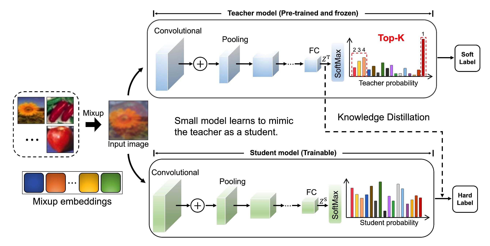

# SHKD

This repo provides a demo for the paper "Soft Hybrid Knowledge Distillation against Deep Neural Networks" on the CIFAR-100 dataset.

## Requirements
- python 3.6 (Anaconda version >=5.2.0 is recommended)
- torch (torch version >=1.1.0 is recommended)
- torchvision (torchvision version >=0.3.0 is recommended)
- pandas
- numpy
- NVIDIA GPU + CUDA CuDNN

## Datasets
- CIFAR-10, CIFAR-100, ImageNet, and others

## Getting started
- Download datasets and extract it inside  `data`
- Teacher Training: `python teacher.py --arch wrn_40_2 --lr 0.05 --gpu-id 0`
- Student Training: `python student.py --t-path ./experiments/teacher_wrn_40_2_seed0/ --s-arch wrn_16_2 --lr 0.05 --gpu-id 0`
- Evaluate Sample:
  - Distillation model of VGG-13 and MobileNetV2 for CIFAR-100 are available at this [link](https://drive.google.com/file/d/1t1iokwk4Gj80547XrDK_T9sTJQviMmJy/view?usp=sharing). Download and extract them in the `experiments` directory.
  - You should achieve 71.95% on CIFAR-100 datasets.

## Acknowledgement
- Thanks for CRD. We build this library based on the [CRD's codebase](https://github.com/HobbitLong/RepDistiller)
